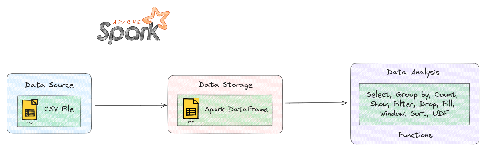

# PySpark DataFrame Operations

  

Welcome to the "PySpark DataFrame Operations." In this project, we will explore the power of PySpark DataFrames for efficient data analysis. Learn to create, transform, and gain insights from large datasets using PySpark's capabilities.

**What is this project ?**
This project serves as a hands-on educational resource for understanding and utilizing PySpark DataFrames. It showcases how to create DataFrames from external datasets, apply transformations, perform data analysis, and derive insights from the structured data. By providing step-by-step examples, this project simplifies the process of learning and applying PySpark's data processing functionalities.

**Why did you do it ?**
This project was developed to address the need for practical and approachable resources to learn PySpark DataFrames. As data analysis and processing become more critical in various fields, there is a growing demand for tools that enable efficient handling of large datasets. This project aims to bridge the gap between theoretical knowledge and practical skills by providing real-world examples of data manipulation using PySpark DataFrames.

**What are the gains from doing this project ?**
1. **Practical Skills:** Learn real data analysis tasks with PySpark DataFrames, preparing for data challenges.
2. **Efficient Processing:** Handle large datasets efficiently using distributed computing capabilities.
3. **Insightful Analysis:** Derive meaningful insights through aggregations, transformations, and filtering.
4. **Applicability:** Gain skills for data analytics, science, and research across industries.
5. **Deep Understanding:** Master PySpark DataFrames, setting the stage for advanced topics exploration.

## Architecture Diagram
1. **Data source (csv):** The project starts with a data source, which is a CSV file containing airline-related information. This CSV file serves as the initial data input.
2. **Data storage (Spark DataFrame):** The data from the CSV file is ingested and stored as a Spark DataFrame. Spark DataFrames are used to efficiently manage and process large datasets in a distributed and parallel manner.
3. **Data analysis functions:** Once the data is stored as a Spark DataFrame, various data analysis functions are applied to gain insights from the dataset. These functions include:
    - **select:** Choosing specific columns or attributes from the DataFrame.
    - **group by:** Aggregating data based on specific columns.
    - **count:** Counting occurrences of data elements.
    - **show:** Displaying a sample of the DataFrame.
    - **filter:** Filtering rows based on specific conditions.
    - **sort:** Sorting the DataFrame based on certain columns.
    - **UDF (User-Defined Function):** Applying custom functions to manipulate or transform data.

